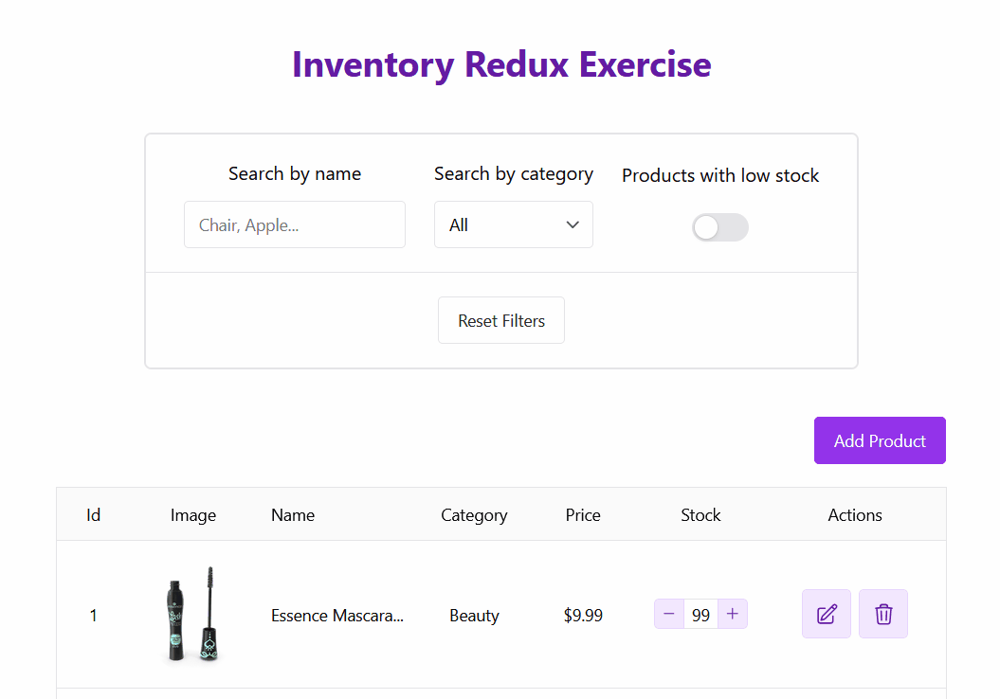

# Inventory Redux

A straightforward inventory manager built to practice Redux Toolkit wihtouth thunks, using custom middleware for async operations and a clean UI powered by Chakra UI.
Create, edit, delete, filter, and manage product stock — all through Redux slices and middleware-driven side effects.

&nbsp;
## Demo


&nbsp;
## Features
- **Full CRUD for products**
  - Create product
  - Edit product
  - Delete product
  - Adjust stock (+/-)
- **Real-time filtering**
  -   Search by name (with debounce)
  -   Filter by category
  -   Show low-stock items
- **Custom middleware**
  - Load initial products from DummyJSON API
  - Persist UI options in localStorate
  - Sync operations with API
- **Modern UI**
  - Chakra UI for styling
  - Sonner for toast notifications

&nbsp;
## Stack
- React + Vite
- Redux Toolkit (RTK)
- React-Redux
- Custom RTK middleware (no thunks)
- Chakra UI
- Sonner
- TypeScript
- ESLint + Prettier

&nbsp;
What I learned
- Handling async logic without thunks using pure Redux middleware
- Splitting global state into *products* and *ui* slices
- Combining slices + selectors to keep components clean and efficient
- Implementing filter using debounce
- Integrating Chakra UI while maintaining a clean state architecture

&nbsp;
## How to run

### Pre-requisites
- Node.js (v22)
- npm

### Installation
```bash
git clone https://github.com/felipe-u/inventory-redux.git
cd inventory-redux
npm install
```

### Run
```bash
npm run dev
```
